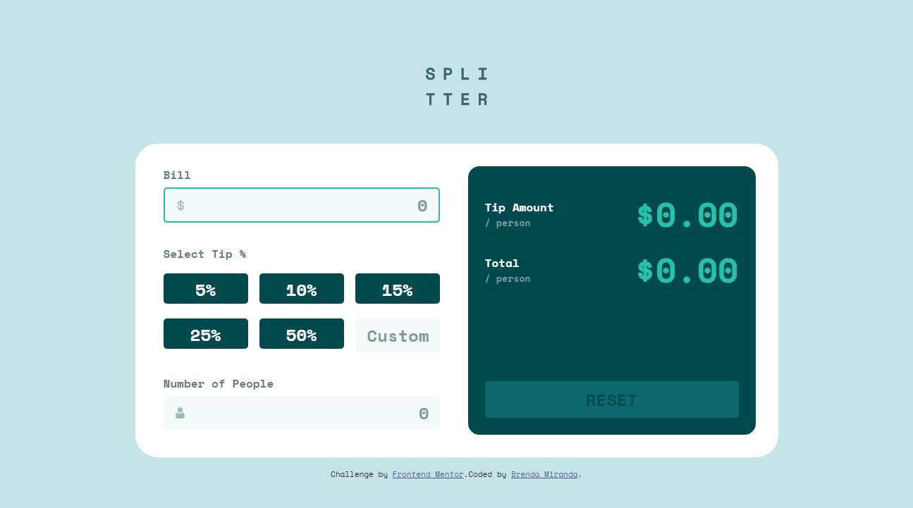

# Frontend Mentor - Tip calculator app solution

This is a solution to the [Tip calculator app challenge on Frontend Mentor](https://www.frontendmentor.io/challenges/tip-calculator-app-ugJNGbJUX). Frontend Mentor challenges help you improve your coding skills by building realistic projects.

## Table of contents

- [Overview](#overview)
  - [The challenge](#the-challenge)
  - [Screenshot](#screenshot)
  - [Links](#links)
- [My process](#my-process)
  - [Built with](#built-with)
  - [What I learned](#what-i-learned)
  - [Thoughts and continued development](#thoughts-and-continued-development)
  - [Useful resources](#useful-resources)
- [Author](#author)

## Overview

### The challenge

Users should be able to:

- View the optimal layout for the app depending on their device's screen size
- See hover states for all interactive elements on the page
- Calculate the correct tip and total cost of the bill per person

### Screenshot



### Links

- Solution URL: [github.com/bmirandach/tip-calculator-app](https://github.com/bmirandach/tip-calculator-app)
- Live Site URL: [bmirandach.github.io/tip-calculator-app](https://bmirandach.github.io/tip-calculator-app/)

## My process

### Built with

- Semantic HTML5 markup
- CSS custom properties
- Flexbox
- CSS Grid
- Mobile-first workflow
- [Sass](https://sass-lang.com/) - CSS preprocessor

### What I learned

I'll talk about my first sass experience in Thoughts, so this space will be to talk about the icon inside the input. It wasn't until I started writing the js file that I realized the better way to add that dollar symbol to the bill input.
I want this burned in my memory.This is The Tip. I can't believe I was using a pseudo-element(::before) to add the icon and then modifying its position with media queries 🥴

So... you leave your input alone:

```html
<input class="cool-bg" type="number" placeholder="0" autofocus />
```

And add the icon to the background with some 'padding' so it doesn't stay at the top left corner:

```css
.cool-bg {
  background: white url('images/icon.svg') no-repeat 15px 15px;
}
```

It doesn't have to be with a class, it can be with the id but..✨classes✨

### Thoughts and continued development

Sass. I've read that word so many times (always accompanied by compliments) that I decided to give it a try. I can see why all the things said are positive but I couldn't get the whole... experience?? I'm still not confident in my ability to name clases, that added to nesting... yeah, I knew I had to stop but wasn't sure when, what a mess.

The thing I felt more confident with were variables, sure the naming needs improvements but I felt good, it made the things I wrote look neater! that besides all the good things that come with variables of course.

I didn't get to use partials, mixins, extend or operators. I didn't try to. I found myself adding more divs after I thought I was done with that. I renamed classes just because the nesting was big... and so with new names I could start a new nest ouside the former one. I was trying to make my project more understandable for me, in a way that I can read what I wrote after waking up and get the idea. Adding more things to the mix when I wasn't comfortable with the things that were already there was a big no. Also I didn't want to stay stagnant because I didn't get the most out of it.
I can't point at this project and say 'hey look at this, look at my project with sass!! 😎 ' with confidence. This is the first project I decided to try sass with. I hope to go back to this project in the future and notice how much I improved.

So... Sass. Need more practice.

JS was a nice break after all my doubts with sass. After a few twists and turns everything was working. There is no message for when the user inputs a negative or decimal number in the input of Number of People. So if the number is not an integer or higher than 0 the input will have the orage border and nothing else, just something I wanted to point out.
 
I'll do more projects, I'll keep practicing my naming ability (for classes and variables). Still have to refine my knowledge about flex and grid, when is one better than the other? And JS! I want more projects with javascript 👀


### Useful resources

- [Sass Basics](https://sass-lang.com/guide) - A guide to see all the things you can do with sass in your project, a must read if you want to know about this preprocessor
- [Setup Sass](https://dev.to/chrissiemhrk/how-to-setup-sass-in-your-project-2bo1) - A step by step guide on how to add sass to your project, exactly what I needed. I couldn't follow the install guide from the official site, sorry ;(
- [CSS grid](https://css-tricks.com/snippets/css/complete-guide-grid/) - It helped me understand the correct way to use the properties, so clear and with visual examples like the guide for flex 🤝
- [Ways to Hide Things in CSS](https://css-tricks.com/comparing-various-ways-to-hide-things-in-css/) - I had to hide a message and here I found the methods to do that, CSS-Tricks does it again!
- [video to learn sass in spanish](https://www.youtube.com/watch?v=rDBzoq86SXY) - More examples about hot to implements sass. I'll have to rewatch this the next time I want to work with sass, it helps to settle the idea 👍

## Author

- Github - [Brenda Miranda](https://github.com/bmirandach)
- Frontend Mentor - [@bmirandach](https://www.frontendmentor.io/profile/bmirandach)
